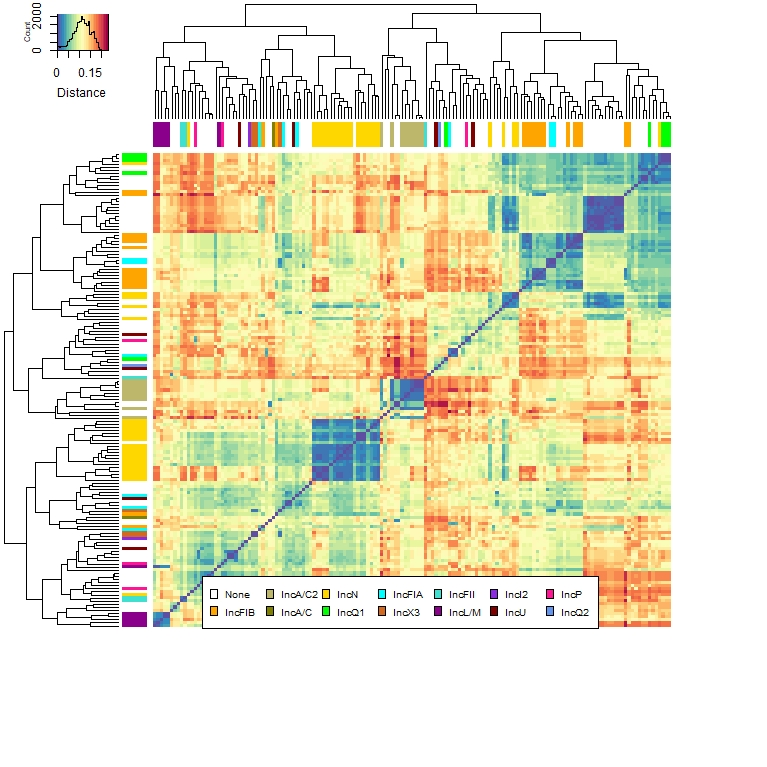

Distance based heatmap.2
===

* tutorial to create a distance based heatmap
* fast distance estimation via ``mash``
* plotting via ``R``
* Another good guide about heatmap.2 can be found [here](https://earlglynn.github.io/RNotes/package/gplots/heatmap2.html)


# Distance via mash

* see github [here](https://github.com/marbl/Mash)
* see example below with a folder full of fasta files

````bash
# better/faster as a blast all versus all
mash sketch -o reference *.fasta
mash info reference.msh
mash dist reference.msh *.fasta > results.tsv
````

* this creates a `results.tsv` for R
* this file was modified afterwards
  * the accession numbers were renamed and metadata was added to each name, e.g. `binA_11_IncA`
  * important if you want to add colors to each branch (see picture below)

# Plotting in R
* step by step in R
* example picture:



## Dependencies

* installing and loading dependencies

````R
source("https://bioconductor.org/biocLite.R")
biocLite("gplots")
library(reshape2);packageVersion("reshape2")
library(RColorBrewer);packageVersion("RColorBrewer")
library("gplots");packageVersion("gplots")
````

* load data and create matrix

````R
setwd("<path to file>")
df.results <- read.table("results.tsv", header = T, sep = "\t")
matrix.results <- acast(df.results, binA~binB, value.var = "distance")
````

## Optional meta data
* **optional step to add colors to branches**
* greps certain values in the name to give it a color
* meta data has to be added to the name (e.g. accessionnumber_metadata)

````R
inc_colour <- unlist(lapply(rownames(matrix.results), function(x){
  if (grepl("no", x)) "#FFFFFF"          # white
  else if (grepl("IncFIB", x))"#FFA500"  # orange
  else if (grepl("IncA/C2", x))"#BDB76B" # dark khaki
  else if (grepl("IncA/C", x))"#808000"  # olive
  else if (grepl("IncN", x))"#FFD700"    # gold
  else if (grepl("IncQ1", x))"#00FF00"   # lime
  else if (grepl("IncFIA", x))"#00FFFF"  # cyan
  else if (grepl("IncX3", x))"#D2691E"   # chocolate
  else if (grepl("IncFII", x))"#40E0D0"  # turquoise
  else if (grepl("IncL/M", x))"#8B008B"  # dark magenta
  else if (grepl("IncI2", x))"#8A2BE2"   # blue violet
  else if (grepl("IncU", x))"#800000"    # maroon
  else if (grepl("IncP", x))"#FF1493"    # deep pink
  else if (grepl("IncQ2", x))"#6495ED"   # corn flower blue
  }))
# important length has to be similar to matrix columns and rows
length(inc_colour)
````

## Plotting data

* create plot via `heatmap2`

````R
# same color gradient as the image from above
Colors <- rev(brewer.pal(11, "Spectral")) # use spectral
color.spek <- colorRampPalette(Colors)(30)
    # use this if you want 0 set to white (change the heatmap2 below)
    color.zerow  <- c("#F8F8F8", colorRampPalette(Colors)(n=900))

# plotting data
heatmap.2(matrix.plasmids, trace = "none", tracecol = "#000000",
  col = color.spek, margins = c(11, 7.5), keysize = 0.8,
  labRow = FALSE, labCol = FALSE, na.rm = T,
  key.title = NA, key.xlab = "Distance",
  ColSideColors = inc_colour, RowSideColors = inc_colour)
````

* add legend to picture

````R
# add name and add colors
leg.name <- c("None", "IncFIB", "IncA/C2", "IncA/C")
leg.color <- c("#FFFFFF", "#FFA500", "#BDB76B", "#808000")
# add legend to heatmap
legend("bottom", legend = paste(INC_names), fill = INC_names_legend, cex = 0.65, ncol = 7, horiz = F)
````

* save as vector graphic

````R
# starts saving everything to svg
svg("Heatmap_spectral.svg", height = 9, width = 9)
# add here the ploting functions e.g.
heatmap.2(.......) # see above
legend(....)
# stops saving everything to svg
dev.off()
````
