Long Read Sequencing Meeting
===
___
*Disclaimer: The views and opinions expressed in this blog are those of the author and do not necessarily reflect the official policy or position of any other agency, organization, employer or company. Assumptions made in the analysis are not reflective of the position of any entity other than the author – and, since we are critically-thinking human beings, these views are always subject to change, revision, and rethinking at any time*

[Homepage](https://www.scilifelab.se/events/long-read-sequencing-meeting/)

# 1. Whats new in long read sequencing at NGI

* national genomics infrastructure (uppsala and stockholm)
* certified service provider of pacbio
* 10x read linked-read sequencing
* Hi-C kits early testing
* ONT - under evaluation currently - want to provide it also as a service

## 1.1 Challenges

* HMW DNA, data management and analysis
* **Long Read club** is online club for this

## 1.2 SweGen

* seq. Of 1000 genomes with different methods.
* they use all the data and combine it
* identify lots of unknown regions
* over 10Mb not presented in human ref. Incl. Worm DNA
* why long read in clinical use:
* [publication about long read seq. In clinic](https://www.ncbi.nlm.nih.gov/m/pubmed/30115375)

# 2. Technologies for long reads

## 2.1 10x Genomics, overview

https://www.10xgenomics.com/

* they have single cell and bulk genomic technologies
* open source free software pipeline
* gelbead emulsion, 8 channels for 8 samples
* micro reaction vessels (gem)
* gem: cell * enzyme * gelebead
*  Linked read libraries
*  basically it's like multiple barcoding and tagging steps to solve some issues of short assembly
*  they tag reads so it's clear from wich HMW DNA the read is originating from
*  e.g. 2 repeat regions, reads from region A are taged red. Region B reads are tagged in blue

## 2.2 Oxford Nanopore, latest

* 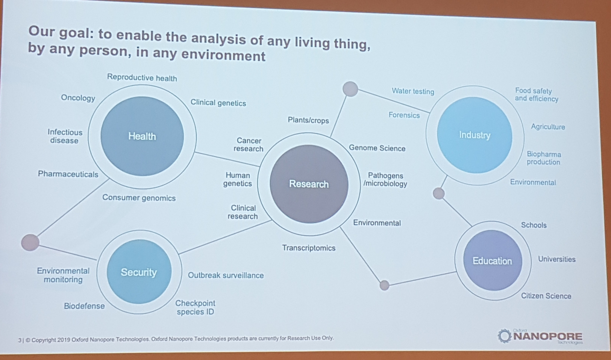
* engineered nanopore, did lot of point mutations
* basecaller to call variations (?), they have specific caller?
* flongle: 1 Gb in 16 h
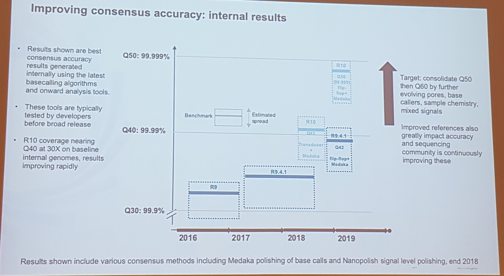
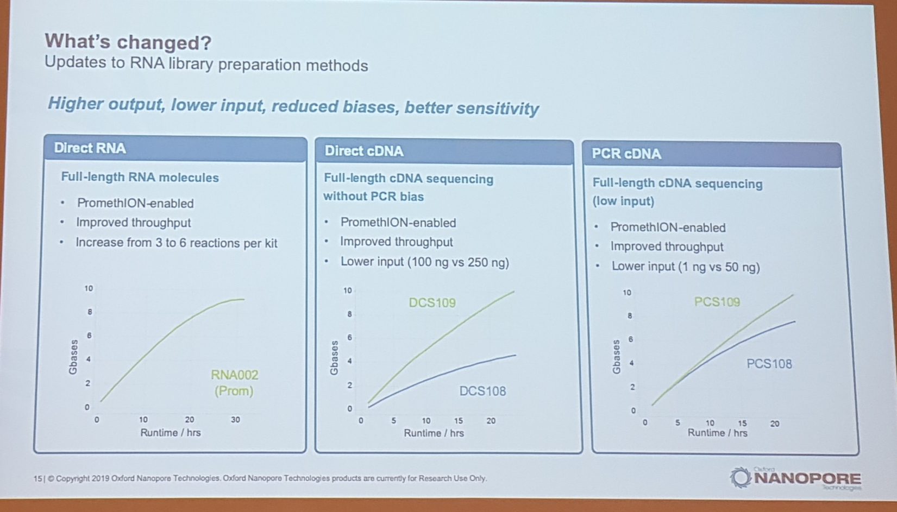
* 200Gb per promethion flowcell
* 24 cell run 3 Tb (125 Gb per cell)

**User publications**

* dark and [camouflaged genes](https://www.biorxiv.org/content/10.1101/514497v1)
* detection of [gene fusions](https://www.ncbi.nlm.nih.gov/m/pubmed/30273778/)
* same day [diagnostic and surveillance](https://jcm.asm.org/content/55/5/1285)

**Nanopore "private Q&A"**

* Flipflop with a methylation aware will come soon
  * use Tombo in github for now to get methylation info
* refueling step will be soon implemented via software, tells you when to do the step
* flongle runs only for around 16h with around 1 Gb
* ubuntu18 guppy soon, no GPU minknow support for live basecalling
* nuclease wash protocol on nanopore site
  * only useful for fast pore dying, not after a big run

## 2.3 PacBio, latest
**Accuracy**

* 89.0 % read accuracy (over 20kb)
  * circular consensus sequencing
  * increased to 99.8% with PacBio HiFi
    * but less than 20kb reads
* basically to improve read quality PacBio needs to decrease total read length. (Circular read consensus)
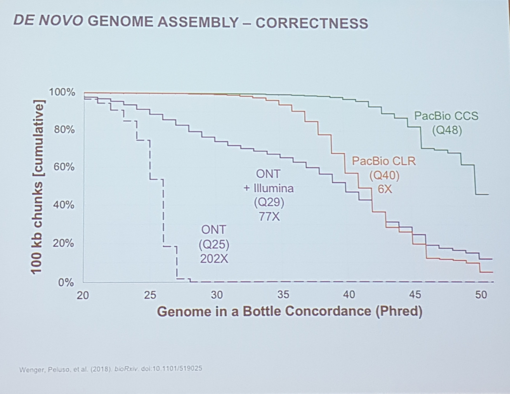
* 15x coverage seems to be enough, more is not increasing quality or accuracy

**Updates**

* improved lib prep protocol for low input
  * 100ng starting input (support at 150ng)
  * starts mid April
* target enrichment using crispr/cas9
  * q3 2019 (2 day protocol)
* RNA still based on RT-PCR

**New sequel II system**

* 8x yield
* lower cost
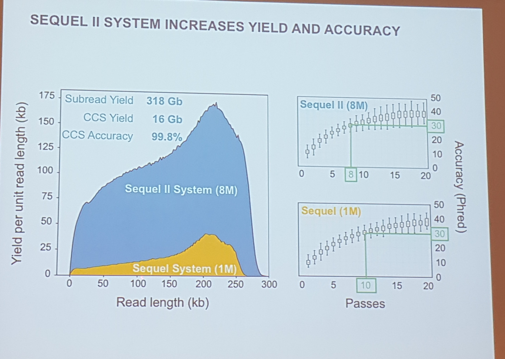
* accuracy seems to bit a smaller bit better than previously
* they claim that it's now getting better than short reads

# 3. Topics and speeches

## 3.1 INRA ENSAT

*Mohamed-Zouine, INRA/ENSAT. Long DNA molecule sequencing:
from de novo assembly to chromosome level scaffolding of the tomato and melon genomes*

* tomato and melon genomes
  * tomato: 12 chromosomes, 950Mb genome
* they Mix pacbio bionano and 10x genomics
  * bionano is optical mapping
  * chromium 10x was used
* have protocol for high gDNA
* annotation via EugenEP pipeline
  * TomExpress for tomatoes
  * jbrowse to explore annotations
* reproduced the results of their pipeline with a melon
* currently doing "phylogeny" on different tomato species
* include now also ONT

## 3.2 Targeted sequencing

*Ida-Höijer, UU. New approaches for long read targeted sequencing*

* "fishing the genome"
* usually via amplification
* CRISPR-Cas9 system for amplification free targeted sequencing from pacbio
  * seq lib. Prep. Like normal
  * cas9 digestion only on pac dna with gene of interest (target)
  * then close these open DNA fragments with gene of interes with another adapter
  * so all circular pac reads with the DNA of interest are now marked
* why no amplification ?
  * different repeat regions length of same target would create strange results in PCR
  * these usually come from PCR errors.
  * so you wouldn't know what's the cause of this
  * but with crispr cas9 you know that the target has different lengths
* Xdrops target enrichment
  * droplet of DNA fragments
  * pcr and labeling of each droplets
  * sorting of these via FACS

## 3.3 Human genome variant calling via pacbio

*Alexander-Hoischen Radboud UMC. Medical  genetics: Identification of hidden structural variants with long read sequencing*

* www.SOLVE-RD.eu solving rare diseases
* 2 people differ in over 4 mio positions
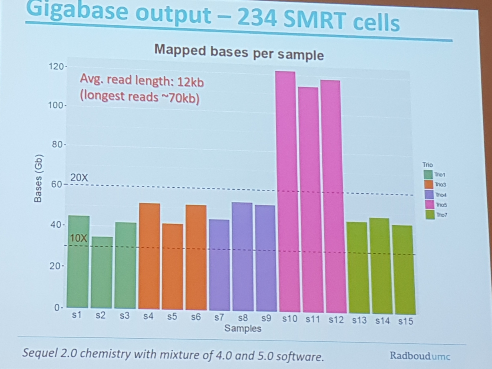
* 28Mb of human genome is only covered via long reads
* pacbio Sv determination
* 10 of the SV are Not represented in the Shorts read data
* 100 inversions per Genome (validation tricky)
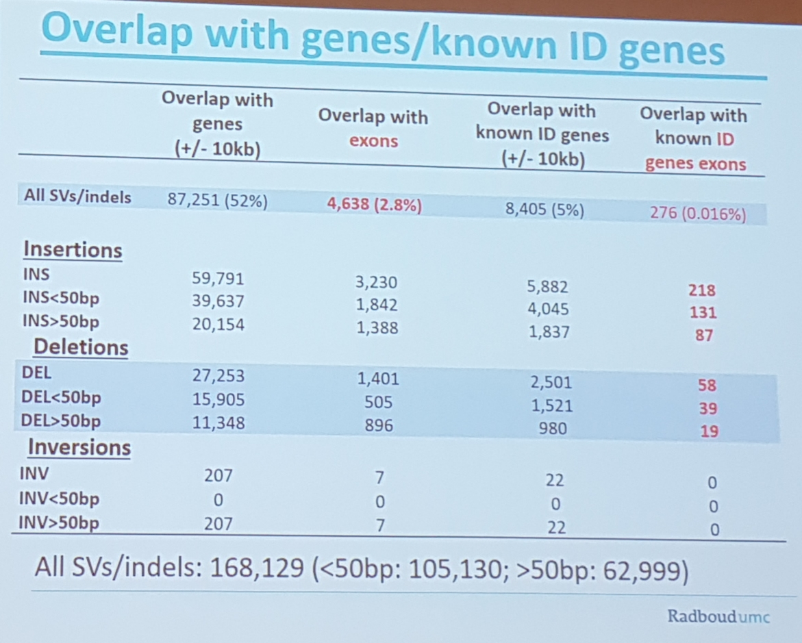
* they can detect SNVs, they are waiting for the new pac bio

## 3.4 Long reads f. personalized therapeutics

*Yahya-Anvar, Leiden University Medical Center. Long reads paving the way to personalized therapeutics*

* genetic factors vary the drug response
* the human genome is complex and incomplete
* 2 gene's, fully duplicated in the genome are responsible for around 80 % of the current drug response
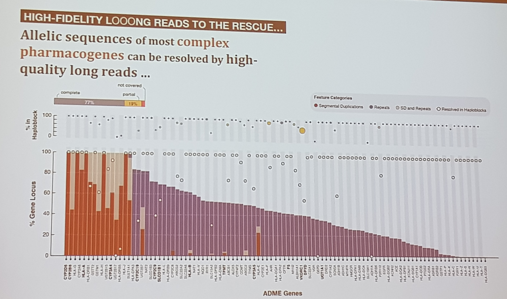
* average pacbio length is 13kb in their experiments (big peak there) nothing really above or below

## 3.5 Human Genome Sequencing on nanopore

*Wigard Kloosterman, UM Utrecht. Unraveling human genome structure using long read Nanopore sequencing*

* chromothripis, Chromosomen Break and reattachment (reshuffling basically)
* question was if nanopore can detect this
* direkt Sequencing of long pcr products
* SV calling using long reads
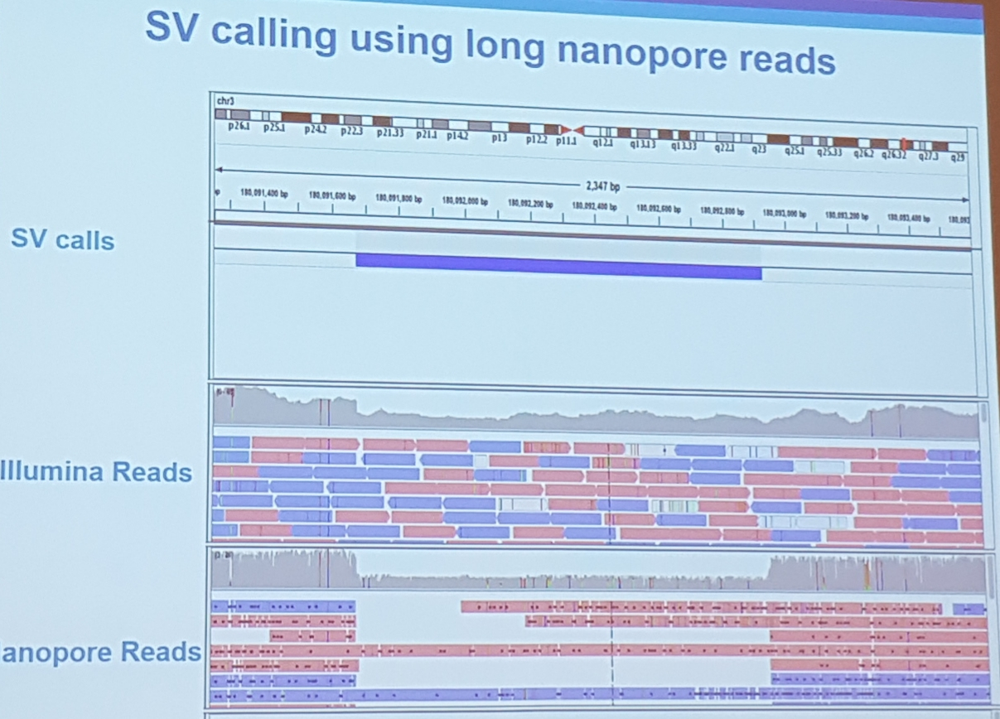
* nanoSV a pipeline to call SVs
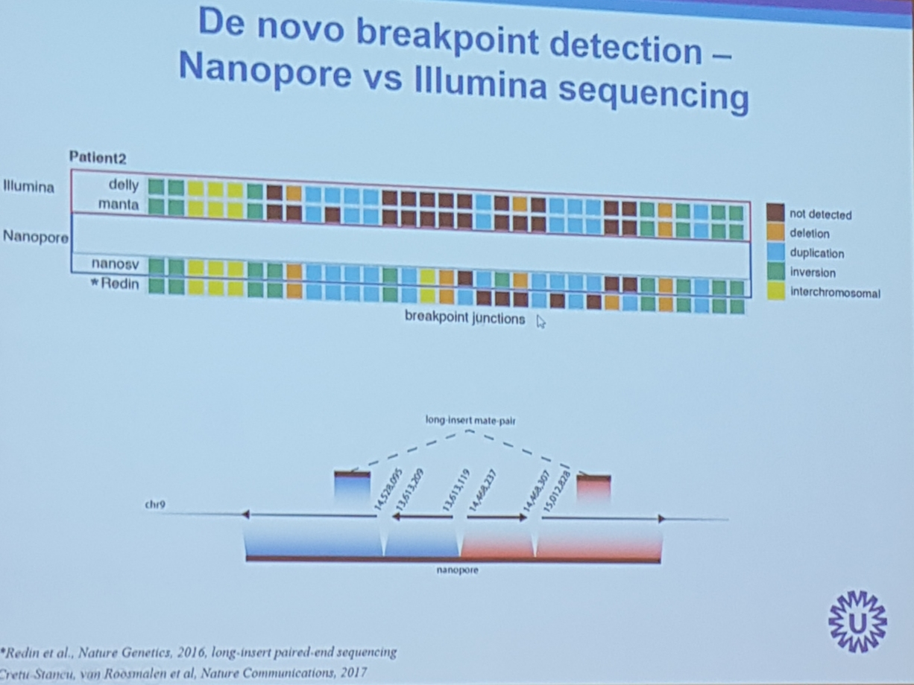
* 14x coverage is needed for SV calling
* showed a crspr-cas9 enrichment was shown. Similar to the pac bio approach: cut and special adapter add
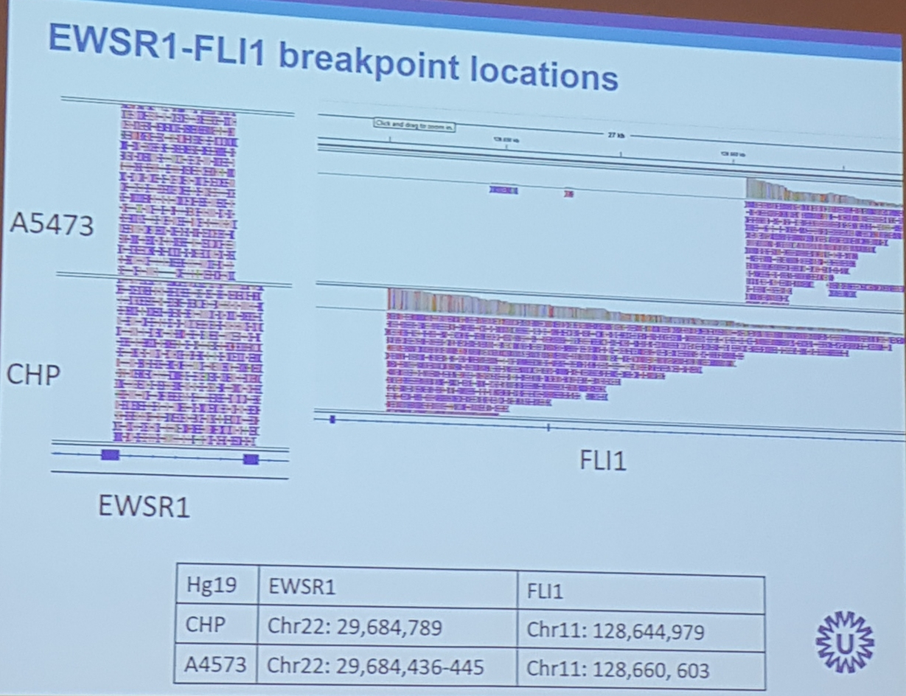

## 3.6 Hybrid assembly honey bee fly

*Matt Webster, Uppsala University. A chromosome level hybrid assembly of the honeybee genome*

* really good data and benchmarks
* pacbio, 10x genomic linkage, bionano
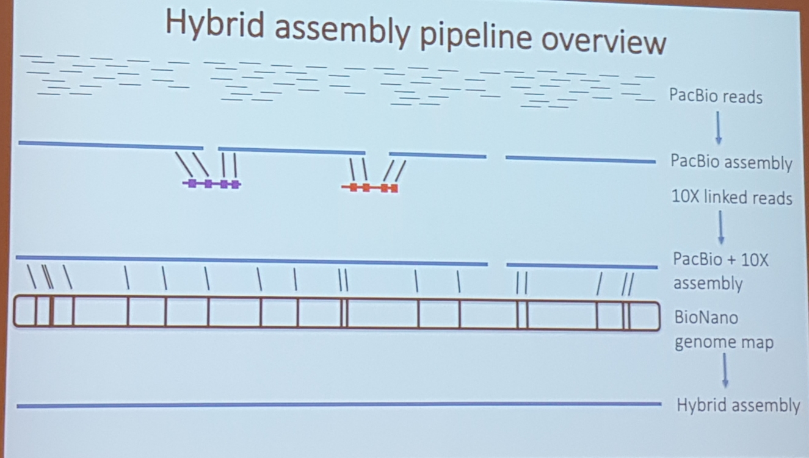

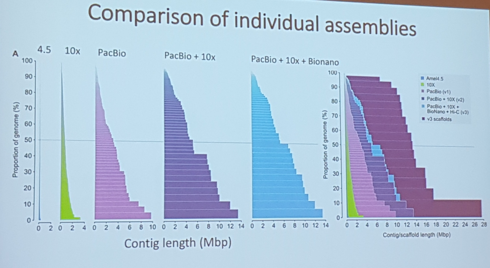
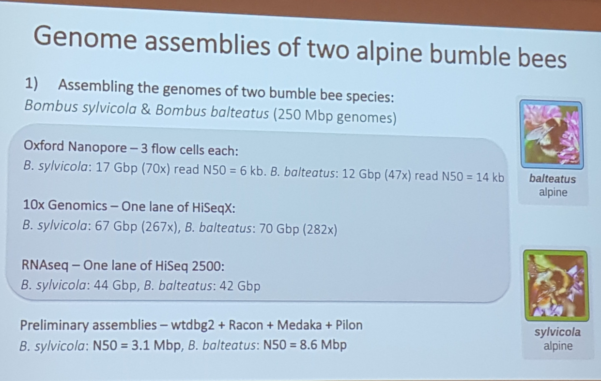

**APPROACH**

* ``wtdbg2`` + ``racon`` + ``medaka`` + ``pilon`` (10x genomes)

## 3.7 Norway sprouch / pine trails

*Niklas Mähler, Umeå University. Long read assembly of Norway spruce and Scots pine*

* they need a reference genome
* they want to decrease the breeding times via genomic selection
* 10 mio scaffolds on the 2013 "WGS 1.0"
* WGS 2.0:
  * 50x pacbio genomic DNA
  * N50 12kb
* removed 0.58 % chloroplast and 7.9 % mitochondria DNA

**Software**

``wtdbg2`` & ``marvel``
* ``marvel``
  * all vs all alignment, no error correction, masks repeats - 150000CPU for one algo round
  * they need 2 mio CPU hours and 1 Pb of storage for pines
* ``wtdbg2``
  * used reads longer than 12kbs on 15x coverage
  * needs lots of RAM
  * they did ``busco`` on ``wtdbg2``, bad results
  * however the 10 mio scaffold aligned nicely
* they have currently "hardware" issues with CPU time and storage due to the size

## 3.8 SMRT analysis on plasmid genes content and methylation profiles

*Åsa Sjöling, KI. SMRT analysis of plasmid gene content and methylation profiles within clonal lineages of enterotoxigenic Escherichia coli (ETEC)*

* *E. coli* plasmids
* interpulse duration for methylation. The lag in measurement of the base is detected
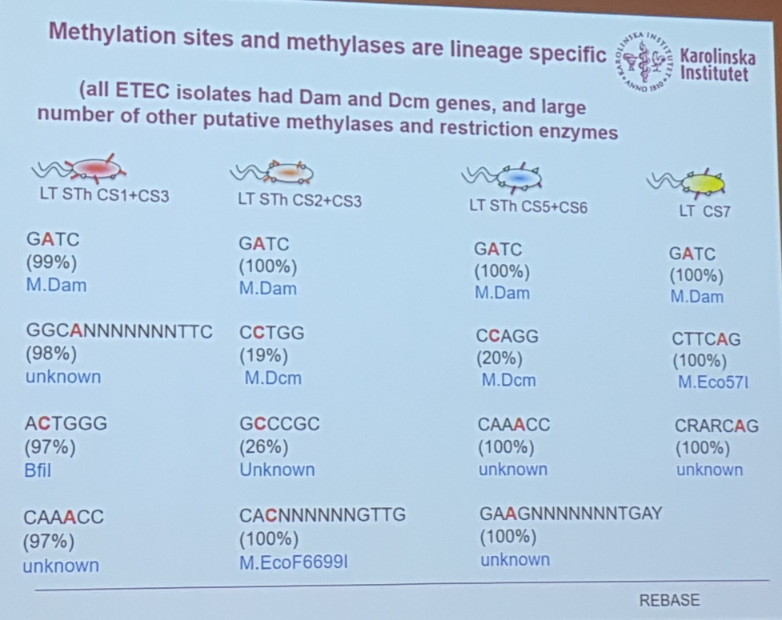
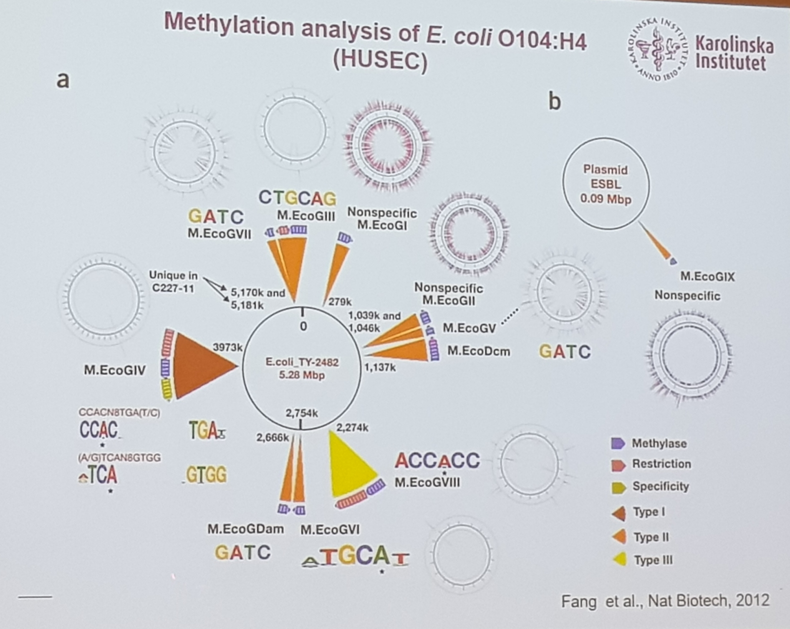
* plasmids harboured the methyltransferase M.EcoGIX, usually in IncI and IncF
  * protects the plasmid of being degrated in another host

## 3.9 Nanopore seq. Gene Fusion and alternative splicing

*Wilfried Haerty, Earlham Institute. Characterization of splicing diversity and gene fusions through Nanopore sequencing*

* human (19.836 Protein coding sequences)
* lots of different splicing types
* example here is calcium channel
  * expressed in various cell types
  * risk gene for multiple disorders
  * they want all isoformes now
  * mRNA over 13kb
  * they only have exon information. Not what's the isoformes?
* analysed various brain regions, so different tissues
* found 90 isoformes, 7 previously annotated, 83 new
* the top 10 isoformes account for 75 % of transcripts
* tissue variation is way greater than between individuals
* 51 of the 83 new are coding
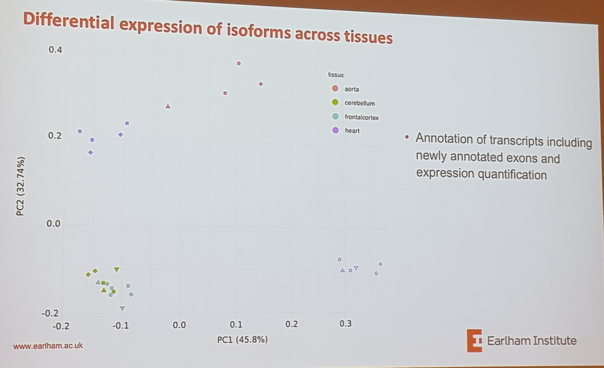
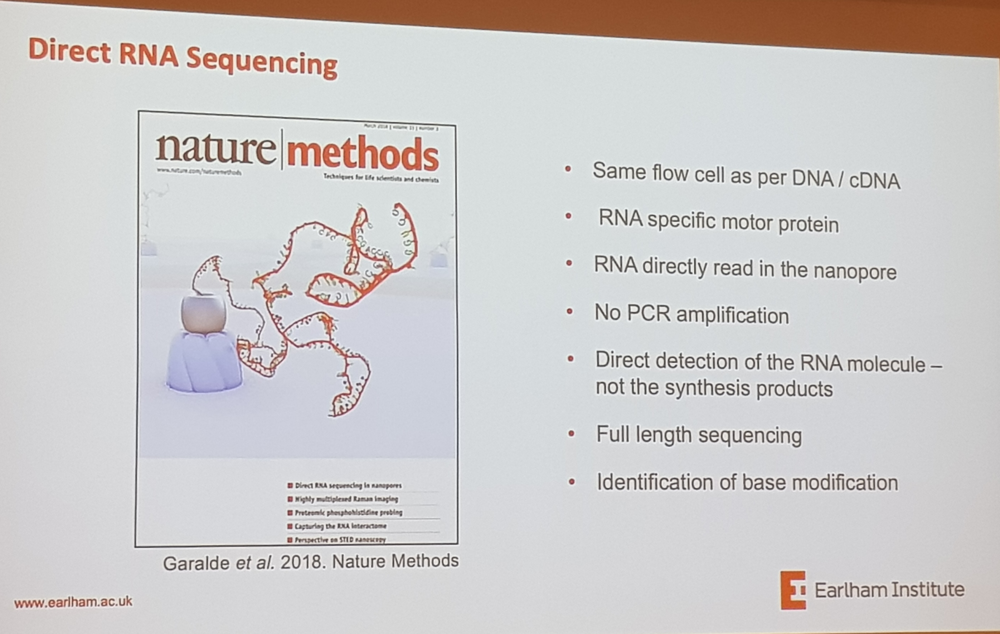
