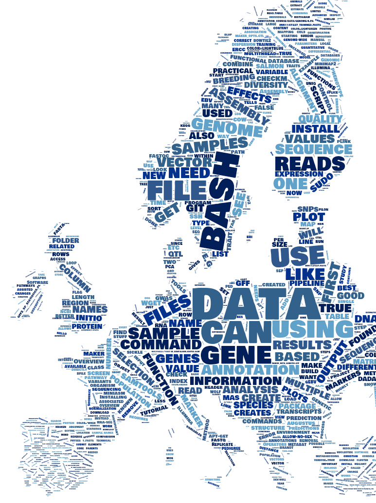

# Bioinformatics Collection

This website is a collection of lectures and tutorials.

* Commands are written as "one liner"
  * use the "triple" mouse click to copy the complete line, because it gets the complete command even if its on 2 or more lines due to website formatting

Created/Collected by Christian Brandt.

* [Researchgate Profile](https://www.researchgate.net/profile/Christian_Brandt5)

* [Google Scholar Profile](https://scholar.google.se/citations?user=YSWxKeoAAAAJ&hl=en)

* [Git Profile](https://github.com/replikation)

## Content cloud

____
## SLU course

* Big thanks to the SLU bioinformatic course at Uppsala
    - [Course site](https://sgbc.github.io/course/)

## License

GNU GENERAL PUBLIC LICENSE
   Version 3, 29 June 2007

Copyright (C) 2007 Free Software Foundation, Inc. <https://fsf.org/>
Everyone is permitted to copy and distribute verbatim copies
of this license document, but changing it is not allowed.
